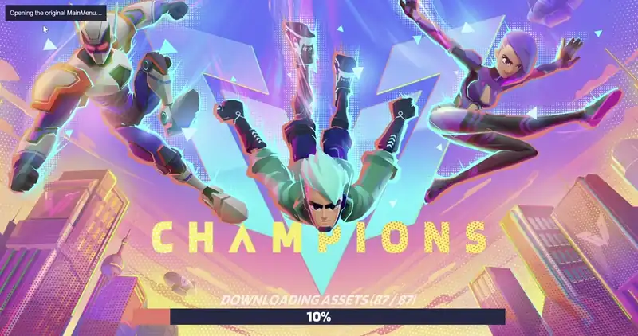
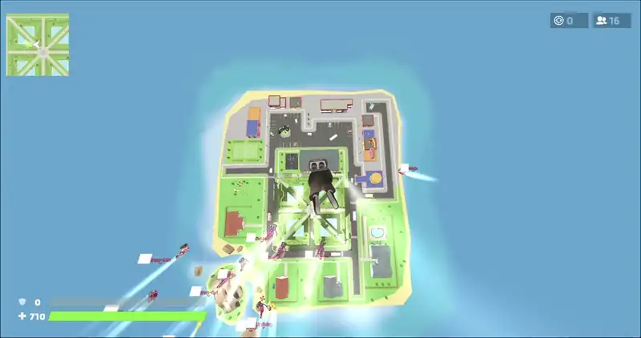

# Self-hosted 1v1.LOL

The original 1v1.LOL client, playable again! (the original game was shut down).

[](docs/media/gameplay.mp4)

## Play

```sh
git clone https://github.com/Davi-ldc/1v1.lol && cd 1v1.lol
./start
```

`./start` installs Bun and `cloudflared`, builds the game and starts a server running on `https://<name>.trycloudflare.com/?k=<key>`.

| Option | Effect |
|---|---|
| `--local` | This machine only, at http://localhost:8080, with no tunnel |
| `--port <n>` | Another port than 8080 |
| `--open` | The bare tunnel address works without the key, so anyone who learns it can play |

The game files come with the repository. `./start` only fetches Bun, the packages and `cloudflared`, each from its own official source.

## What works

- Practice, the main menu and the loadout, with every item and champion unlocked at the original maximum level.
- Multiplayer: 1v1, Zone Wars and the custom modes whose maps ship in the build, with matchmaking, parties, invite links, editable names and reconnection after a drop.
- Custom heroes built on the original rigs (below).

In a match: Q fires the champion's ability, F takes the pickaxe, G edits (the right button or the scroll wheel resets), C selects the ramp, and holding B opens the emote wheel. For a party, one player presses "+" and Party Up; the others press "+" and Join with code, or open the invite link.

## Custom heroes

[](docs/media/heroes.mp4)

You can add your own heroes: a model bound to an original champion's skeleton, plus abilities written against the client's own systems. [heroes/README.md](heroes/README.md) describes the files a hero needs and how to add one.

## How it works

The page loads the original Unity WebGL build. Where the client needs a service that no longer exists, the project changes as little as it can: a byte patch in the WebAssembly, a hook on one of the client's own methods, or a local answer from the server, such as the Photon server that runs matches and parties. Each change is the smallest one that lets the original code path run, and the code says why.

## Differences from the original

- The store, battle pass, personal offers, Locker, app-store badges and the ×2 XP booster are hidden.
- You play as a guest with and the lobby's profile panel edits your name.
- AUTO EQUIP picks a fixed preset first.
- The custom-mode list is rebuilt from the modes whose maps ship in the build.
- Party codes have one digit.
- Photon allows 60 s to connect and 30 s of silence before it disconnects.
- The scroll-wheel edit reset is on by default. 

## Agent

Agents and contributors start at [docs/SKILL.md](docs/SKILL.md). The code layout is in [docs/architecture.md](docs/architecture.md#layout).

### Running the server

```sh
bun install
bun run setup                # builds artifacts/ from playtika/ and checks the 42 preserved files by SHA-256
bun run play --profile lan   # or practice, menu
```

`bun run setup` needs no network: it joins the parts of the one file over 45 MB, gunzips the three `.unityweb` files, cuts `WebGL.data` into its ten entries at their recorded offsets, and ends with the check of `bun run verify`, 48 pins over 42 files. A build of your own can go in `artifacts/original/` instead; `src/host/build/pins.ts` lists each expected path with its size and SHA-256.

`bun run play` also takes `--port`, `--heroes <dir>`, and `--public` with `--host <name>` behind your own tunnel or reverse proxy. With `--public`, every request needs the access key from `.lan/key`, which the printed link carries; the key and the players' IDs stay in `.lan/`, out of git.

### Tests

```sh
bun run typecheck && bun test
bun run probe --profile practice --scenario movement,edit,weapon
bun run probe --profile menu \
  --scenario loadout,armor,reopen,champions,lobbyplay,cosmetics,autoequip,railgun,nopopup,dance,editmenu
bun run probe --profile lan \
  --scenario duel,zonewars,partylink,partyleave,matchmaking,lobbyui,rename,photonbudget,photonreconnect
```

Without the built game, `bun test` skips the tests that read it. A probe plays scripted scenarios in an isolated browser with no outside network; run one at a time. It needs Linux or WSL with `unshare`, user and network namespaces and `ip`, plus the Chromium build that matches the project's Playwright:

```sh
bun node_modules/playwright-core/cli.js install chromium
```

The isolation, the flags and the exit codes are in [docs/architecture.md](docs/architecture.md#probe). Hero scenarios need `--heroes <dir>` ([heroes/README.md](heroes/README.md)).

### Reverse engineering

```sh
python3 -B re/extract/il2cpp/recover.py        # once: the IL2CPP tables, into re/data/
bun run re method|slot|type|field|cell|disasm|calls|callers|xref <query>
```

[re/README.md](re/README.md) covers the extractors, and the `re` skill (`.claude/skills/re/SKILL.md`) the queries and the evidence standard.
